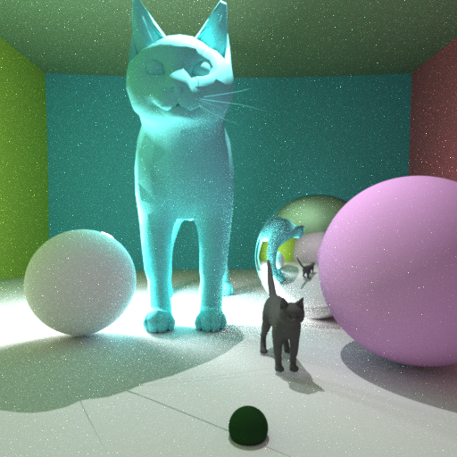
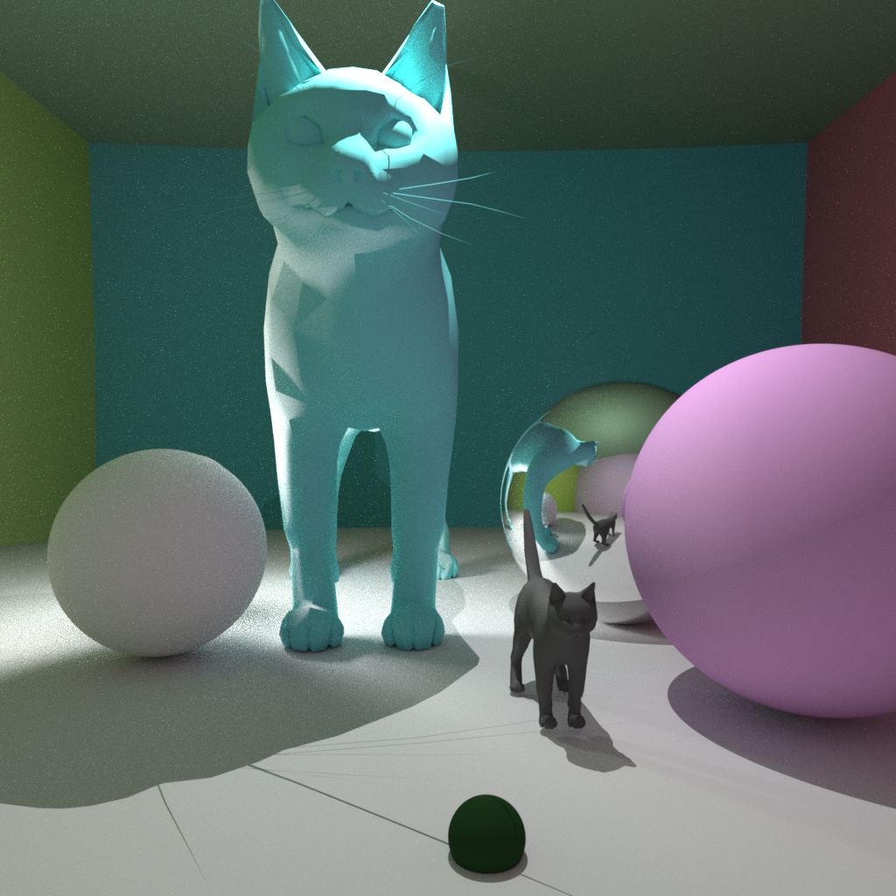
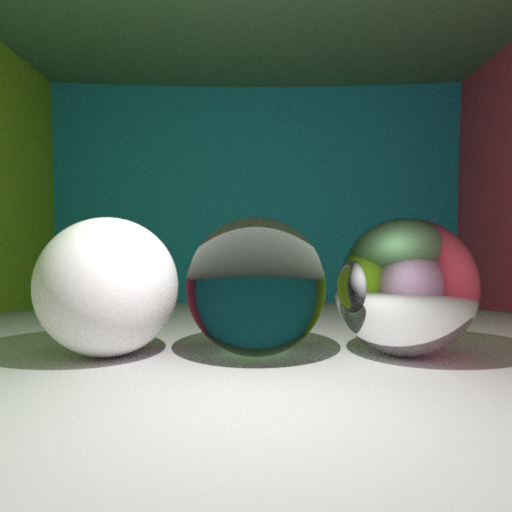
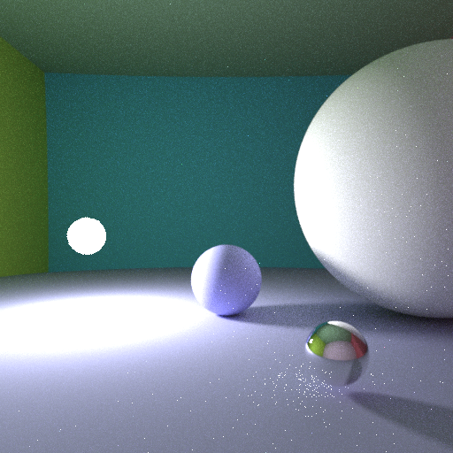
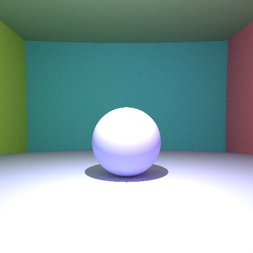
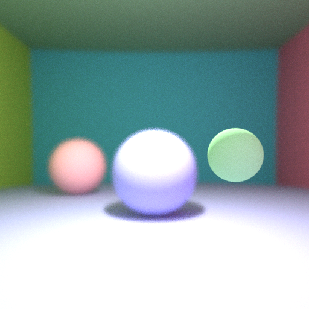
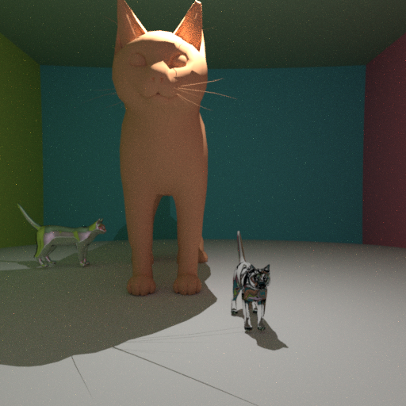

# Assignment 1 Report
### Pedro Cabral

## Raytracer

*Image 0*

The image above illustrates the different parts of the raytracer combined together to produce a scene containing triangle meshes, diffuse and reflexive spheres, indirect lighting, antialiasing, and spherical light sources. Over the next sections, we are going to give an overview of the different components of the raytracer together with rendering examples. 

The goal is to make all examples reproducible. Therefore, for each image in the folder "images", I will include also the code for the scene in the folder "scenes".

### Overview

We separate our code into different components. 

The most fundamental files are `gx_vector.h` and `gx_vector.cpp`. It implements the Vector class, used to represent positions, vectors, and colors in our raytracer. It also implements the `Matrix` class, which is a useful tool for the rotation of objects. 

We have the `gx_geometry.h` file that defines the `Object` virtual class and the classes that implement it. In the file `gx_geometry.cpp`, we implement the `Sphere` and `TriangleMesh` classes. In our raytracer, we will render these two types of objects. 

When a ray hits an object, we generate an `ObjectHit` object. It contains important information about the hit:
+ `P` The point where the ray hit the object
+ `N` The normal of the object at `P`
+ `tHit` The distance that `P` is from the ray origin
+ `object_ptr` A pointer to the object 

In our implementation of the raytracer, we use an update semantics: We call the `Object.updateIntersect(const Ray &ray, ObjectHit &hitInfo)` method by passing the `ObjectHit` instance by reference. Then, the instance of `ObjectHit` is only updated if an intersection is found with a distance smaller than `tHit` from the ray origin.

For the `TriangleMesh` class, the implement the BVH algorithm. The file `binary_tree.h` provides the implementation of a binary tree class that is used by the BVH algorithm.  

For both `TriangleMesh` and `Sphere` we implemented geometric transformations. These are: `transformTranslate`, `transformScale`, and `transformRotate`. They do exactly what their name specify. For the `TriangleMesh` class, we rebuild the BVH binary tree after every transformation. 

We keep the properties of an `Object`'s material in the `Material` class, defined in `gx_material.h`. This simple class contains information such as albedo, mirror, transparent, and light. 

The files `gx_camera.h` and `gx_camera.cpp` define and implement three different Camera models: `AliasedCamera`, `PinholeCamera`, and `ProjectiveCamera`. Each camera model implements a `generate_ray` method, that generates a (possibly random) ray from the camera center to the specified pixel. The `AliasedCamera` is the first camera model explained in the lecture notes. It does not perform antialiasing: the camera shoots a ray to the center of the pixel. The `PinholeCamera` implements `generate_ray` by shooting a ray distributed according to a gaussian distribution centered at the pixel center. Finally, `ProjectiveCamera` implements Depth of Field (DoF) by taking two extra parameters in its constructor: the focal distance and the radius of the aperture. 

Finally, the file `gx_scene.h` implements the logic of the `getColor(Ray, ...)` function. It determines the color found by shooting a ray in the scene. We implement
+ direct lighting 
+ mirror, transparent, and diffuse surfaces
+ indirect lighting
+ spherical light sources

The `main` function is in the file `main.cpp`. The current usage was designed for the reproducibility of the examples shown in this report. The `Makefile` can be used to generate an executable `render`. The usage is:

`> ./render sceneIdx`

where `sceneIdx` is the index of an image in the report. The program will ask the user to input the desired number of rays per pixel. Finally, the program will save the rendered image to the `image.png` file. Notice that all scenes in this report are defined in the file `./scenes/gx_scenes`.

<!-- -->
### Diffuse, Mirror, and Transparent Surfaces

*Image 1*

Three different spheres: Diffuse (to the left), Transparent (in the middle), and Mirror (to the right). It took 1.9s to render using 100 rays per pixel and no indirect lighting.

*Image 2*

The same setting but with indirect lighting and 5 bounces per ray. It took 10.5s to render.

<!-- -->
### Lighting 

#### Spherical Light Sources

*Image 3*

This image shows the effect of a sphere light source. Because of the noise in indirect lighting, we shoot 400 rays per pixel. It takes 56.6s to render.

#### Indirect Lighting 

The pictures above show that our raytracer incorporates indirect lighting.  

<!-- -->
### Camera Models

We implement three different Camera Models that correspond to the classes `AliasedCamera`, `PinholeCamera`, and `ProjectiveCamera`. Each camera class implements a method `Ray generate_ray(int i, int j)` that (possibly using randomness) shoots a ray around pixel `(i,j)`.

By shooting rays from the camera directly to the pixel centers we get images with pronounced edges. 

*Image 4*

Image produced by an instance of `AliasedCamera`. This image takes 6.5s to render with 100 rays per pixel. Notice that the edges are not smooth. 

#### Pinhole Camera and Antialiasing

*Image 5*

The same image produced by an instance of `PinholeCamera`. This image takes 7s to render with 100 rays per pixel. Notice that the edges are much smoother than in the previous image.

#### Projective Camera and Depth of Field

We can introduce Depth of Field (DoF) with the `ProjectiveCamera` class.

*Image 6*

Notice that the farther spheres are out of focus. This image took 7.8s to render with 100 rays per pixel. The focal distance was 10 and the radius of the aperture was 5E-2. The spheres are approximately 10, 45, and 70 units of distance away from the camera. Notice how the farther spheres are blurred while the closest one is sharp.

<!-- -->
### Triangle Meshes (with BVH)

In this section, we implement triangle meshes with the BVH algorithm for intersections. 

*Image 7*

Three cats. The left cat is a mirror, the middle cat is diffuse, and the right cat is transparent. The image takes 32.4s to render with 100 rays per pixel. 