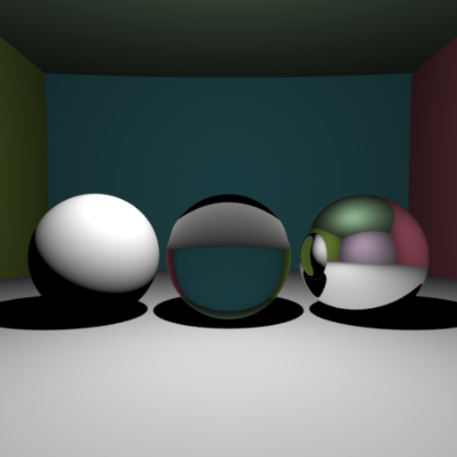

# Assignment 1 Report
### Pedro Cabral

## Raytracer

The image above illustrates the different parts of the raytracer combined together to produce a scene containing triangle meshes, diffuse and reflexive spheres, indirect lighting, antialiasing, and spherical light sources. Over the next sections, we are going to give an overview of the different components of the raytracer together with rendering examples. 

The goal is to make all examples reproducible. Therefore, for each image in the folder "images", I will include also the code for the scene in the folder "scenes".

